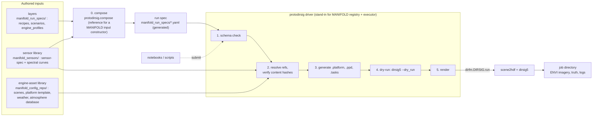
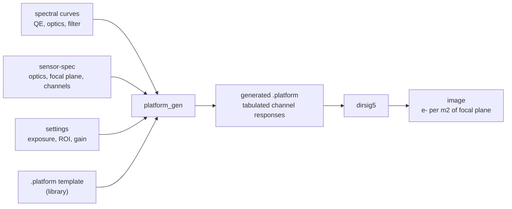

# MANIFOLD–DIRSIG CONOPS and Guide (as built)

**Scope:** the driver for DIRSIG5 jobs from MANIFOLD run specs (`dirfm`, `protodirsig`, notebooks) and the
interface it presents to MANIFOLD.
**Status of the document:** a theory of the interface, tested against the code in this repository and
periodically against the MANIFOLD implementation team. Section 10 records each disagreement and its outcome.
**Authority:** this document is the single description of what is built. When code and document disagree,
the code is right until the document is corrected in the same commit.

## Overview

protoDIRSIG is the DIRSIG-side driver of the MANIFOLD synthetic-data path, built without the MANIFOLD
registry, executor or orchestrator. A run spec states a collection and a sensor; it is composed from layer files
(a recipe naming a scenario, an engine profile and a library sensor), and the driver validates it, generates the
DIRSIG input files that the spec determines, executes `dirsig5`, and returns imagery with truth.
`LocalRegistry` stands in for the registry and executor so the interface to MANIFOLD can be exercised before
they exist.

### System workflow



1. **Author and compose.** A run is authored as layers: a recipe (meta, settings, fidelity, and the names of the
   other layers), a scenario (the collection), an engine profile (origin, extras, the engine block) and a
   library sensor, never copied. `compose` merges them into one run spec, or, for a sweep recipe listing several
   sensors, one run spec per sensor (section 3.5). A run spec splits into
   `descriptor` (what was observed: engine-independent, registered, hashed) and `engine` (how DIRSIG is driven:
   origin-specific, not indexed). The sensor is a reference into the sensor library; scenes, platform
   template, weather and atmosphere are references into the engine-asset library.
2. **Admit.** Schema check, reference resolution with content-hash verification, and a DIRSIG dry-run. An
   admitted run has resolvable inputs and a command line `dirsig5` accepts.
3. **Assemble.** A job directory is built under `outputs/`: library files copied or linked, and the files the
   spec determines generated into it (`.platform` from the sensor, `.ppd` from the motion block, `.tasks`
   from the collection epoch and windows).
4. **Execute.** `dirfm` invokes `scene2hdf` and `dirsig5`. A seeded render is byte-reproducible.
5. **Return.** Imagery in electrons per m² of focal plane, truth bands, and logs in the job directory.

### Sensor path



The sensor description is the single source for modeled sensor values. The library `.platform` supplies only
what the specs do not model (names, mount, truth collections, spatial response, hypersampling). Swapping the
sensor changes the `sensor` reference and nothing else in the run spec.

### Roles

| Role | Today | Future |
|---|---|---|
| Input construction | `compose` (`compose_sweep`), `scripts/compose.py`, `LocalRegistry.submit_recipe`, `submit_sweep` | MANIFOLD input constructor, with `compose` as its reference (C-21) |
| Sweep execution | `LocalRegistry.run_sweep`: per-run state under a sweep id | MANIFOLD orchestration; how a sweep id is recorded is C-22 |
| Registry and admission | `LocalRegistry`, `simulation.schema_errors` | MANIFOLD registry (hashing, extraction, catalog) |
| Executor | `Simulation.run` | MANIFOLD executor; mounts the DIRSIG runtime |
| Generator | `run_spec`, `platform_gen`, `motion_tasks` | SDK (`src/protodirsig`) |
| Orchestration | notebooks | Dagster (out of scope here) |

### Repository folders and their MANIFOLD counterparts

A `manifold_` prefix marks a folder that maps to a future MANIFOLD repository (`manifold_sensors` and
`manifold_run_specs` are provisional names until the MANIFOLD team names those repositories).

| Folder | Holds | Counterpart |
|---|---|---|
| `manifold_config_repo/` | engine assets | MANIFOLD config repository |
| `manifold_sensors/` | sensor-spec library, spectral curves | sensor profile library |
| `manifold_run_specs/` | layer files and the run specs composed from them | registered run specs |
| `manifold_contracts/` | schemas, vocabulary, validators, conformance vectors | `manifold-contracts` |
| `src/protodirsig/` | driver and SDK | SDK |
| `external/`, `scripts/`, `notebooks/`, `tests/`, `outputs/` | tooling | none |

The sections below are the detailed description. Section 10 records the points where this description and the
MANIFOLD documents disagree.

Status markers used in section headings and tables:

| Marker | Meaning |
|---|---|
| `built` | Implemented and covered by a test or an executed notebook. |
| `built, partial` | Implemented for the AUROR job only; the limits are stated. |
| `proposed` | Offered to MANIFOLD. Not adopted in their schema or architecture documents. |
| `open` | Question for MANIFOLD; no position taken. |

## 1. Purpose

protoDIRSIG takes a `run-spec/1` YAML and executes the run it describes through `dirfm`, with no
MANIFOLD executor, registry, or orchestrator. Its purposes are: (a) establish which parts of a
`dirsig-engine/1` run spec a real job can be driven from; (b) validate and integrate `dirfm`; (c) grow an
abstraction layer (`src/protodirsig`) into the SDK; (d) provide notebooks for new `dirfm` and SDK users;
(e) test the MANIFOLD requirements by conforming to them. The reference job is the AUROR static NIR pass over
DIRSIG's Tahoe scene, `manifold_run_specs/auror_ref.yaml`.

## 2. System overview

Layers, bottom to top:

- **DIRSIG5** (`dirsig-2026.38.0.a020954`): `scene2hdf` and `dirsig5` binaries. Inputs are files; the scene is
  consumed by path.
- **`dirfm`** (RIT, read-only dependency): Python builders for DIRSIG input files, and `DIRSIG.run()`, the only
  code that constructs a `dirsig5` command line.
- **`src/protodirsig`**: gap-fillers and the run-spec driver (section 7).
- **Notebooks**: stage notebooks (the conformance template), `dirfm` tutorials, sidebars (section 8).

A recipe is composed into a run spec (`compose`, section 3.5); a composition error names the layer file and field.
A run spec then becomes a run in three steps, each independently testable (hash verification and `.platform`
rendering sit in steps 2 and 3):

1. **Schema check** (`simulation.schema_errors`): required members and enumerated values of `run-spec/1` and
   `dirsig-engine/1`.
2. **Resolution** (`run_spec.resolve_auror_run`): `engine.*` becomes `dirfm` objects and file paths.
3. **Execution check** (`Simulation.validate`): the job is assembled in a scratch directory and run with
   `dirsig5 --dry_run --log_info_filename`.

`LocalRegistry.submit` runs the three and accepts or rejects; `submit_recipe` composes first. `Simulation.run`
renders only an accepted run; `submit_sweep` and `run_sweep` do the same for every run of a sweep.

**Resolved versus generated** `built`. Each `engine.*` block is one or the other.

- *Resolved*: the block names an existing file and the spec selects it by reference. `scenes`, `platform`,
  `atmosphere.database`, `weather.file`. Nothing is built from spec values.
- *Generated*: the block, or the sensor description it references, states values from which a file is built at
  job-assembly time. `motion` (`.ppd`), `tasks` (`.tasks`) and the `.platform`. Motion and tasks use
  `dirfm.platform_motion.PlatformPosition` and `dirfm.tasks.TASKS` and are `built, partial`:
  `motion.kind: static` with Euler orientation in the `scene`/`sceneenu` frames. `waypoints` and `orbit` need
  `dirfm.FlexMotion` and are rejected at resolution. The `.platform` is rendered from the library template
  by `platform_gen` (section 4); `engine.platform` still names the template.

Generation happens where `Simulation._assemble()` copies resolved assets into the job's `inputs/` directory.
The closest MANIFOLD analog is `materialize` into `<work>/<run_id>/inputs` (Configuration_v02, line 309).

`resolve_auror_run` is narrow by design (`built, partial`): `new_atmosphere`, ephemeris `spice`, weather
`library`, one scene, static motion. It raises `RunSpecError` on anything else, so what it accepts is a lower
bound on what the schema permits.

## 3. Run-spec contract `built, partial`

A run spec is one YAML document with three keys (Metadata_v02 §6.3).

| Key | Required | Content |
|---|---|---|
| `spec_version` | yes | `run-spec/<major>`; currently `run-spec/1`. |
| `descriptor` | yes | Engine-independent. Governed vocabulary, units, frames, provenance. Authority for catalog search. |
| `engine` | no | Origin-specific generator input; one schema per origin (`dirsig-engine/1`). Absent for field data. Not indexed. |

`descriptor` is registered, searched, and hashed into the provenance record. `engine` is what the generator
and executor consume.

### 3.1 `descriptor`

Required blocks for `run-spec/1`: `meta`, `origin`, `collection`, `sensor`, `settings`, `fidelity`. `field`
is required iff `origin.kind: field`. `extras` is optional. Unknown keys are rejected everywhere except
`extras`.

- **`meta` / `origin`.** `meta.name` is an immutable alias to one `parameter_set_id`. `origin` has two axes,
  `kind` (`synthetic`, `field`) and `engine` (`dirsig`, `satsim`, `usd`, `field`); `engine: field` iff
  `kind: field`. DIRSIG: `origin: {kind: synthetic, engine: dirsig}`.
- **`collection`.** Observation conditions as governed terms and derived quantities, not engine parameters.
  `atmosphere.regime` is a vocabulary term, not a DIRSIG preset. `epoch` is phenomenon time (read from
  `.tasks`). `geometry.range` is required when `targets` is non-empty.
- **`sensor`.** A `sensor-spec/1` reference, or the sensor-spec's `sensor` block in place; structure per
  `AV_MANIFOLD_Detector_v02` (section 4).
- **`settings`.** Commanded per-entry values: exposure, frame rate, gain, black level, ROI, binning. One
  member per run (C-19), naming the `sensor.entries[]` entry the run models; `entry_id` must resolve. Stays in the run spec, not the sensor file.
- **`fidelity`.** `modeled`, `approximated`, `absent` lists and free-text `valid_for`. Authored, not
  derived, not queryable.
- **`extras`.** Namespaced `<origin>.<name>`; stored as `jsonb`; no query guarantees.
- **Quantities.** A `quantity` is `{value, provenance, uncertainty?, uncertainty_kind?, conditions?}`.
  `provenance` is `measured`, `specified`, `modeled`, or `inherited_from_type`; `conditions` is required
  when `measured`. Fields fixed by design are plain scalars.

### 3.2 `engine` (`dirsig-engine/1`)

The `engine` section is origin-specific: one schema per engine, selected by `descriptor.origin.engine`.
DIRSIG (`dirsig-engine/1`) is the first engine implemented. Others (`satsim`, `usd`) will follow with their own
`<engine>-engine/<major>` schemas; none of what follows constrains them. The `descriptor` is the
engine-independent part of the contract and is shared across all engines. This document describes the DIRSIG
engine only.

Members (Configuration_v02 A.8.1): `generator`, `scenes`, `platform`, `motion`, `tasks`, `atmosphere`
(required); `weather`, `ephemeris`, `run` (optional).

- **Division with `descriptor`.** Epoch, exposure, frame rate, gain, and black level are stated once, in
  `descriptor`; the generator writes them into `.tasks` and `.platform`. Platform position at epoch is
  emitted by the generator and may be omitted from an authored spec.
- **`scenes[]`.** Library scene references with optional `[x,y,z]` offsets. `scene2hdf` compiles the HDF at
  run time beside the `.scene` file; the HDF is derived, outside the manifest, never pre-compiled in the
  library.
- **`platform`.** References a library `.platform` by name and hash; the file is a template. The generator
  (`platform_gen`) substitutes every value `descriptor.sensor` and `descriptor.settings` model (section 4) and
  keeps the rest: names, mount, truth collections, spatial response, hypersampling, bandpass.
  `output_prefix`, `split_channels`, `integration_samples`, and `channel_response`: `tabulated` (default)
  writes each channel as a tabulated response; `native` reproduces the received platform's DIRSIG gaussian
  channel (section 9) and is used only by `auror_ref.yaml`. `split_channels: true` is refused at resolution:
  it asks for one spectral state per channel, which the `new_atmosphere` database does not hold (section 9).
- **`motion`.** `static | waypoints | orbit`. Orbit propagation (skyfield + SGP4 with UT1–UTC) runs outside
  DIRSIG; only ECEF waypoint samples cross into the engine body.
- **`tasks`.** `{start, stop}` windows relative to `descriptor.collection.epoch`; `start == stop` is one
  static sample.
- **`atmosphere`, `weather`, `ephemeris`.** `atmosphere.plugin` is `four_curve` or `basic` in A.8.7.
  AUROR uses `new_atmosphere` (`proposed`, section 10). `ephemeris.plugin: spice` takes no inputs and reads
  kernels from the DIRSIG installation.
- **`run`.** Seed, convergence, thread count. Recorded on the execution record, not in identity.
  `engine.run.seed` is confirmed to work: `dirfm.DIRSIG.set_seed` passes `--random_seed` to both
  `scene2hdf` and `dirsig5`, and seeded renders are byte-identical across assemblies. `--threads` is not in
  `engine.run`.
- **Not in the body** (A.7): quaternion orientation, STK report import, velocity-tracking `up`, `EarthGrid`,
  jitter, uniform or classic radiative transfer, turbulence, uniform weather. A tree needing these is
  registered with a hand-written descriptor.

### 3.3 Outside both sections

Installation-resident data (`FourCurveAtmosphere` presets, SPICE kernels, `ThermWeather` files read with
`weather.source: install`) is covered by a Merkle hash per DIRSIG installation (`engine_data_sha256`) on the
execution record. Execution parameters are on the execution record, not the registered spec.

### 3.4 Admission `open` (MANIFOLD-side)

The generator emits files and descriptor from one run spec; admission validates and hashes the emitted
descriptor, not the authored one. `contract_version`, `_schemaURL`, `system_configuration_id`, and
`noise_class` are set after the gate and are never authored. The extractor reads values back from the
registered files and compares them with the descriptor (MD-13); a column with no extractor path is
`unvalidated`. protoDIRSIG implements none of admission, extraction, or hashing. The loader is
`yaml.safe_load`; stamped `content_hash` values of sensor files and curves are verified by the loaders, `.scene` refs remain placeholders; duplicate-key rejection is absent.

### 3.5 Composition `proposed`

A **run** is one composed run spec and one execution; its **job directory** is the DIRSIG working directory of
that run; a **sweep** is the set of runs one recipe composes to. The authored file that names a run's layers is a
**recipe**.
Runs are authored as layer files and composed into the single `run-spec/1` that MANIFOLD receives, so the
scenario and the engine block are written once and the sensor file is never copied: a new sensor is a new
library file, a new engine a new engine-profile file. `protodirsig.compose` is the reference for a MANIFOLD input
constructor (C-21): what composes and validates here is what that constructor should accept, and the user needs no
knowledge of MANIFOLD internals (descriptor/engine split, hashes, admission-set fields). The composed spec obeys
the `run-spec/1` rules unchanged, so if MANIFOLD declines layered submission only the authoring layer is lost.

| Layer | File | Supplies |
|---|---|---|
| recipe | `manifold_run_specs/recipes/<name>.yaml` | `descriptor.meta`, `settings`, `fidelity`; names the other layers |
| scenario | `manifold_run_specs/scenarios/<name>.yaml` | `descriptor.collection` |
| engine profile | `manifold_run_specs/engine_profiles/<name>.yaml` | `descriptor.origin`, `descriptor.extras`, `engine` |
| sensor | `manifold_sensors/<file>.yaml` | `descriptor.sensor`: `{ref: {name, content_hash}}`, or inline |
| (generated) | `manifold_run_specs/<name>.yaml`, or `<name>--<sensor>.yaml` per sweep run | the composed run specs; tracked, `GENERATED` header |

An engine profile is the engine block for one scenario under one engine (scene, motion, tasks, atmosphere,
generator, run); splitting scene-specific from engine-general content is deferred. `auror_ref` and
`synthetic_vis` share the scenario and the engine profile `tahoe_static_pose`; the AUROR recipe sets
`engine_overrides: {platform.channel_response: native}`, the one path the rules allow a recipe to override.

Recipe fields (rules version `compose/1`): `compose: compose/1`; `meta` (`name`, `tags`, `description`);
`sensor` (a sensor-library file name) or `sensors` (a list of them: a sweep); `scenario` and `engine_profile`
(layer names); `settings` (members keyed by `entry_id`); `fidelity` (`modeled`, `approximated`, `absent`,
`valid_for`); optionally `fidelity_by_sensor` and `engine_overrides`.

Rules:

- The layers own disjoint members. A member present in two layers is an error, not a merge; no member may be
  held by two layers. An unknown key or a missing required member is an error.
- `engine_overrides` maps a dotted path under `engine` to a value. Only the paths on the rules' allow-list may be
  set, today `platform.channel_response`; the path's parent must be a mapping the engine profile holds. Anything
  else is an error on the recipe field.
- Each `settings` member's `entry_id` must name an entry of a listed sensor, at most once; each run's settings
  follow its sensor's entry order. The `roi` check (section 4) and, for a DIRSIG run, the black-level refusal
  (section 9) apply to the composed spec.
- `descriptor.sensor` is the ref form by default, its `content_hash` the sha256 of the sensor file's bytes;
  `inline_sensor` puts the sensor-spec `sensor` block in place. The loader and resolver accept both.
- No descriptor key is added outside the layers' members. Layer provenance (file and sha256 per member) and the
  sweep id are returned beside the specs and printed by `scripts/compose.py --explain`, never written into a spec.
- The same layers give the same bytes. Errors name the layer file and the field in it, never a path in the
  composed document.

**Sweeps** `built, partial`. A recipe naming `sensors: [<file>, ...]` composes to one run per listed sensor, in
list order (`compose.compose_sweep`; `compose` refuses it). The layers are shared; only the sensor, the settings
for its entries and, optionally, the fidelity differ. The sensor is the only axis: the list zips with `settings`
by `entry_id`, and there is no cross product. A member whose `entry_id` belongs to no listed sensor, a listed sensor
with no member, and an `entry_id` held by two listed sensors are errors. A run's `meta.name` is
`<meta.name>--<sensor file stem>`, with tags and description shared; `fidelity_by_sensor: {<sensor file>: {...}}`
replaces the shared `fidelity` for that run, and may cover every sensor in place of it. A sweep has at most 32 runs
(`compose.MAX_RUNS`, overridable per call), checked before anything else is read. The **sweep id** is the first
12 hex digits of the sha256 of the recipe's bytes; it is returned with the runs and is not in any run spec.
`LocalRegistry.submit_sweep` submits every run, each `accepted` or `rejected` with its reasons, and `run_sweep`
renders the accepted ones, each `rendered` or `failed` with the error text. One rejected or failed run never stops
the others. Every run carries the recipe's `engine.run.seed` unchanged; a shared seed does not give equal noise
across sensors. `recipes/sensor_sweep_tahoe.yaml` sweeps the three library sensors in 32 × 32 windows
(`stage_03_sensor_sweep`).

`scripts/compose.py [--check] [--inline-sensor] [--explain <recipe>] [--refresh-vectors]` writes
`manifold_run_specs/<name>.yaml` for a one-run recipe and `<name>--<sensor file stem>.yaml` for each run of a sweep;
`--check` fails on a stale, missing or orphaned generated file. `run_spec.derive_run_spec` composes through the
same merge.
Conformance vectors for a constructor are in `manifold_contracts/vectors/compose/`. The generated `auror_ref` and
`synthetic_vis` equal the flat files they replaced member for member, and their `.platform`, `.ppd` and `.tasks`
are byte-identical.

## 4. `sensor-spec/1` `built`

A sensor system is reusable across runs. `sensor-spec/1` is the `descriptor.sensor` block as its own
document: `spec_version: sensor-spec/1`, `meta` (`name`, `tags`, `description`), and `sensor` as in 3.1.
A run spec carries `descriptor.sensor: {ref: {name: "<name>.yaml", content_hash: "sha256:<hash>"}}`; the name resolves against the
sensor library, `manifold_sensors/`. The sensor-spec's `sensor` block in place (`sensor_system` and `entries`) is
also accepted (section 3.5; C-21). The first entry is `manifold_sensors/auror-nir.yaml`.

`content_hash` on a file ref is the sha256 of the file bytes, stamped by `scripts/stamp_hashes.py` (`--check`
fails on a stale hash). The loaders verify a stamped hash when they read the file; the `sha256:<hash>` placeholder
is not verified. A `.scene` ref stays a placeholder because its geometry and materials sit beside it.
MANIFOLD's canonical-JSON hash replaces this (C-12).

Each focal plane carries a `detector` block: the physical device, whose properties are fixed.
`DeviceVendorName`, `DeviceModelName`, `SensorWidth` and `SensorHeight` (the full frame), `SensorPixelWidth`,
`SensorPixelHeight`, `fill_factor`, `channel_layout`. A value not known is `null`, never a guess.
The window DIRSIG models, usually a subset of the full frame, is the commanded `roi` setting
(`Width`, `Height`, `OffsetX`, `OffsetY`, SFNC names) in the run spec's `settings` member for the entry. The
generator writes the window's size as DIRSIG's element counts and its offset as the array offset, (offset +
size/2 − full frame/2) × pitch in µm, so a window images the part of the field its offset names; a null offset is
a centred window, and an offset with a null full frame is refused. The loader rejects a `settings` member whose
`entry_id` matches no sensor entry, and a known `roi` that exceeds the detector's full frame.
A run models one sensor entry with one focal plane and one `settings` member; a sensor-spec with more entries
or focal planes, or a `settings` list of another length, fails at resolution with a specific error. A focal plane
may carry several channels; each becomes one band of the image.
**Spectral model.** The response DIRSIG sees is the product of three factors that the spec keeps apart
(Detector_v02 §4.4): `optics.throughput_reference` (transmission of the common path), the channel's shape
(`srf_reference`, a curve, or the program-minted `srf_model`: `gaussian` with `center` and `fwhm`, or
`rectangular` with `center` and `width`, peak 1, an edge sample weighted by the fraction of its grid bin inside
the band), and `qe_reference` (absolute QE). References are
`{name, content_hash}` to `spectral-curve/1` files under `manifold_sensors/spectral/<kind>/` (`manifold_sensors/spectral/README.md`).
Vendor and measured curves enter through `scripts/import_curve.py`, which keeps the source grid, converts nm and
percent, refuses out-of-range values, and records `source`, `acquired` and the measured range. A curve is never
extrapolated: zero response outside the measured range is written only on request (`--pad-zero-to`) and
recorded in the file's `padding` line.
`optics.throughput_in_band` is the band mean of the optics curve, or, with no curve, the grey scalar written as
DIRSIG's `aperturethroughput`; with a curve the generator writes `aperturethroughput` 1 and folds the curve into
the channel, so the factors are applied once. A channel with no `qe_reference` has unit QE. The generator
tabulates the product on the template's bandpass grid and refuses a channel whose response lies outside it
(over 0.1 %), because the job's spectral data end there.

Units: `aperture_diameter` and `focal_length` are millimetres; the generator writes DIRSIG's `aperturediameter`
in metres and `focallength` in millimetres. `fill_factor` is the linear element size over spacing. A generated
channel is named by its `channel_id`, which becomes the ENVI band name.

**Radiometric reference.** Each channel's `radiometric_reference` is the sensor's own radiometric calibration
(Detector_v02 §6.8), for example DN to spectral radiance. Detector_v02 requires `quantity` and `unit`; no library
sensor has a known calibration, so both are `null`, and `scale` and `offset` are omitted. The schema closes
`quantity` to Detector_v02's five members (`radiance`, `spectral_radiance`, `irradiance`,
`brightness_temperature`, `digital_number`) or `null`. What the image holds is a property of the engine, not of
the sensor: for DIRSIG, photo-electrons per m² of focal plane over the exposure (section 9; C-20).

**Fields an engine other than DIRSIG would need.** A field audit found one engine-shaped field in
`sensor-spec/1`, the former electron `radiometric_reference`; the rest are sensor properties, some of which the
template substitution consumes. These Detector_v02 fields are absent or null in every library sensor and would be
needed by an engine that models the detector chain (for example SatSim):

| Need | Detector_v02 field | Today |
|---|---|---|
| Spatial response | `mtf_at_nyquist_row`, `mtf_at_nyquist_column`; a PSF kernel (sampled function, referenced) | absent; PSF has no field; DIRSIG keeps the template's |
| Temporal noise | `read_noise`, `dark_current` (with detector temperature), `noise_figure` | absent |
| Saturation and conversion | `full_well`, `conversion_gain` (e-/DN), `linearity_error` | absent; `settings.gain` is commanded and unitless |
| Calibration | `radiometric_reference` `scale`, `offset` (required with `digital_number`) | null |
| Defects | `defect_fraction`, `defect_map_reference` | absent |
| Readout timing | `readout.rolling_line_period`, `exposure_time_min`, `exposure_time_max` | absent (Global shutter only) |
| Geometry | `array.offset`, `optics.focus_distance` | absent |

`AdcBitDepth` is present but library-asserted. Platform jitter is absent on the platform side.

Library entries: `auror-nir` (AUROR_ref; vendor, model, and full frame not recorded; no QE), `deepscan_850_306_nir_1280`
(Eoptic DeepScan, Teledyne SCION 1280 x 1024 VisGaAs; synthetic QE until vendor data), and
`synthetic_600_200_vis_1920` (an invented VIS camera: 50 mm, 200 mm, 1920 x 1080 at 5.5 um, synthetic silicon QE
and lens curves). A different sensor is a different run: `recipes/synthetic_vis.yaml` names the VIS camera with
`auror_ref`'s scenario, and `run_spec.derive_run_spec` makes such a spec from a loaded one. There is no run-time
sensor override.

Several required `sensor` fields have no DIRSIG source (`SensorShutterMode`, `AdcBitDepth`,
`timestamp_reference`, `optical_path`, `system_id`, `reference_frame`). They are assigned in the library entry
with `provenance: specified` or `modeled`, not read from any DIRSIG file. A value the template camera cannot
express is refused by the generator rather than dropped: a mount other than fixed identity, a distortion model,
a channel layout other than `single`, a shutter other than `Global`, a `timestamp_reference` other than
`exposure_start` (DIRSIG integrates from the task time). `AdcBitDepth` is not written: the image is in
electrons, and DIRSIG quantizes only inside its detector model, which is not generated. `entry_id` joins each sensor entry
to its `settings` member in the run spec.

## 5. Repository layout and resolution roots `built`

```
manifold_config_repo/
  scenes/<scene>/<scene>.scene  # geometry/, materials/, maps/ as descendants
  platforms/<platform>/<platform>.platform
  weather/<name>.wth
  atmosphere/<name>             # proposed path; see section 10
manifold_run_specs/
  recipes/<name>.yaml           # compose/1 recipe: meta, settings, fidelity; names the layers below and a sensor
  scenarios/<name>.yaml         # descriptor.collection
  engine_profiles/<name>.yaml   # descriptor.origin, descriptor.extras, engine
  <name>.yaml                   # run-spec/1, GENERATED by scripts/compose.py from recipes/<name>.yaml
manifold_sensors/               # sensor library: sensor-spec/1 documents; never copied into a run spec
  spectral/<qe|optics|filter>/  # spectral-curve/1 CSVs
manifold_contracts/             # schemas, vocabulary, validators (sensor-spec-1.schema.json)
  vectors/compose/<case>/       # conformance vectors for an input constructor
external/                       # pinned dirfm, agent-docs, DIRSIG link; gitignored (pins.json tracked)
src/protodirsig/  tests/  notebooks/
scripts/                        # bootstrap, compose, stamp_hashes, import_curve, crosscheck_sgp4
tests/fixtures/auror_ref/       # motion and tasks files; compared with generated files only
outputs/<job>/                  # ephemeral job directories; gitignored
```

Refs resolve by which side of the schema they sit on.

| Ref | Resolves against |
|---|---|
| `engine.*` (`scenes[].ref`, `platform.ref`, `atmosphere.database.ref`, `weather.file`) | `manifold_config_repo/` |
| `descriptor.*` (`sensor.ref`) | `manifold_sensors/` (the sensor library) |
| `engine.motion`, `engine.tasks` | not resolved; generated into the job directory |

Each library folder is a resolution root and maps to a future MANIFOLD repository. Any `descriptor` ref
added later resolves against its own library, regardless of where the engine-asset library lives. `manifold_config_repo/` is read-only at run time. A job directory holds a scene reference
copy (geometry and materials symlinked back to the library), byte-identical copies of the weather file and
atmosphere database, the `.platform` rendered by `platform_gen`, and the generated motion and tasks files.

`manifold_config_repo/` follows Configuration_v02 A.8.3 for `scenes/` and `platforms/`. The nesting is also DIRSIG's
own convention: `$SCENE_DIR` defaults to the `.scene` file's folder, and the reference layout nests
`geometry/`, `materials/`, `maps/` there.

Library assets are real files. The MANIFOLD hashing procedure rejects symlinks (Configuration_v02 §2.3), and
symlinks appear only in the per-run view the executor builds (AD A-42). `manifold_config_repo/` therefore holds no
symlinks. Data that ships with the DIRSIG installation (`FourCurveAtmosphere` presets, SPICE kernels, demo
scenes) is not copied into it: presets are referenced by name and covered by the installation's data hash.

A top-level folder exists here only if it has a MANIFOLD analog. `AUROR_ref/` had none and is retired to the
test fixture.

## 6. Using `dirfm`

- **Read-only.** `dirfm` is never modified. Its `demos/test_*.py` suite is the usage reference. Install
  editable from a sibling checkout; do not run `pip install -e` from inside the checkout (it writes
  `egg-info`); use `sys.path.insert` if needed outside the conda workflow.
- **Environment.** Each notebook sets `DIRSIG_HOME` and prepends `bin/` to `PATH` in its first cell and
  asserts `scene2hdf` and `dirsig5` resolve.
- **Existing scenes.** `dirfm` builds scenes; it does not read them. A pre-existing `.scene` is referenced by
  setting `SCENE._fname` to its path, which makes `write()` a no-op returning that path. The coverage check
  then runs against a dummy material database and carries no information; use
  `protodirsig.scene_coverage` against the real `.mat`.
- **Command line.** All `dirsig5` flags go through `DIRSIG.run(**options)` (`None` becomes `--flag`, a value
  becomes `--flag=value`). `run()` always runs `scene2hdf` first.
- **Gaps and workarounds in `src/`.**

| Gap in `dirfm` | Handling |
|---|---|
| `NewAtmosphere`: six attributes never initialised under `_FrozenAttrs`; `"Isacc"`/`"Distort"` typos | `atmosphere_patches.py`; test flags an upstream fix |
| `PlatformSensorPlugin.prepare()` always regenerates platform, motion, tasks; `write_files()` assumes that plugin | `platform_ref.py` |
| `SPICEPlugin` requires three kernel paths | supplied by `platform_ref.py` |
| `PlatformPosition.add_entry` formats angles `{:0.6f}`, positions to 3 decimals (~1e-7 per pixel) | accepted; suggest `{:.17g}` upstream |
| `DIRSIG.set_output_prefix` stores `_prefix`; nothing reads it | not used |
| `SCENE._check_coverage` passes vacuously on a `_fname` scene | `scene_coverage.py` |
| No `EarthGrid`, STK-report import, quaternion orientation, velocity-tracking `up`, SGP4 engine | skyfield for propagation; fixed `up` vector verified per pass; tiled `GROUND_PLANE` |

## 7. SDK as built (`src/protodirsig`)

| Module | Role | Status |
|---|---|---|
| `compose` | run specs composed from recipe, scenario, engine profile and library sensors (`compose/1`): one run, or one per sensor of a sweep | `built`; rules `proposed` |
| `run_spec` | run-spec loader and AUROR resolver | `built, partial` |
| `platform_gen` | `.platform` rendered from the library template, `sensor-spec/1` and `settings` | `built` (one focal plane per entry) |
| `spectral` | `spectral-curve/1` reader, channel shapes, response composition | `built` |
| `motion_tasks` | `.ppd` and `.tasks` generation from `engine.motion`, `engine.tasks` | `built, partial` (static) |
| `simulation` | schema, resolution, execution checks; render | `built` |
| `registry` | `LocalRegistry`: local stand-in for submission | `built` |
| `scene_ref`, `platform_ref`, `scene_coverage`, `atmosphere_patches` | `dirfm` gap-fillers | `built` |
| `orbit`, `sensors` | skyfield TEME→ECEF and trajectory; sensor helpers | `built` |

`scripts/compose.py [--check]` writes the generated run specs; `scripts/stamp_hashes.py [--check]` stamps
`content_hash` values in sensor and layer files and verifies them in generated run specs; `scripts/import_curve.py`
converts measured curves to `spectral-curve/1`. Pending work is in `BACKLOG.md`.

## 8. Notebooks

| Notebook | Role |
|---|---|
| `stage_01_auror_from_runspec` | AUROR job from `auror_ref.yaml`, seeded, motion and tasks generated |
| `stage_02_conformance_template` | same job through `LocalRegistry`, then `Simulation.run`; adds an 8-pixel Lambertian visibility disk (albedo 0.8) in a library mirror under `outputs/` |
| `stage_03_sensor_sweep` | the sensor library, its curves and composed channel responses; the sweep recipe `sensor_sweep_tahoe` through `compose_sweep`, `submit_sweep` and `run_sweep`; three sensors rendered at 32 × 32 with GSD from the truth |
| `dirfm_tutorials/` | `dirfm` basics; orbit-to-ground (Stage 3 unwritten); Tacoma; AUROR direct |
| `sidebars/vehicle_point_source` | distils the vehicle mesh to a radiant intensity; renders the emitter with thermal prediction forced |
| `dev/` | local discovery logs; gitignored |

`notebooks/README.md` describes each in detail.

## 9. DIRSIG behaviors that matter

Measured on `dirsig-2026.38.0.a020954` unless stated. Each was confirmed by test, render, or the DIRSIG
documentation.

**Rendering and sampling**

- **Targeted oversampling exists.** An instance named with `::IMPORTANT::` is hypersampled: central sample
  strategy with `<hypersamplingmultiplier>` (set to 100 in `AurorNIRDetector.platform`; five pixels around
  the vehicle received 2000 samples against a frame median of 22). Adaptive sampling does not target
  sub-pixel geometry.
- **Emission is not evaluated by default in a 0.41–2.0 µm job.** Temperature prediction, including
  `DataDriven` temperatures, is off unless the simulation covers the thermal spectrum.
  `dirsig5 --force_temperature_prediction` enables it. A material with zero reflectance and `TEMPERATURE`
  set renders exactly zero without the flag. The flag is global.
- **Point sources only illuminate.** DIRSIG5 does not draw a directly viewed `<basesource><pointsource>`;
  `sources.html` lists direct viewing under "Relevant Options (DIRSIG4 only)". An unresolved emitter or
  reflector is rendered as real geometry at true scale, hypersampled, with ε(λ)·B(λ,T) or a reflectance
  model. A flux-matched small emitter (radiance × area = I) is the equivalent for a distilled intensity.
- **Distilled intensity.** I(λ) = L̄·A_proj from a close-range, no-atmosphere render at the task's sun and
  view angles (`vehicle_point_source` sidebar): A_proj = 0.826 m², I = 67.0 W sr⁻¹ µm⁻¹ for ρ = 0.30 in the
  AUROR channel. Background-subtraction uncertainty is ~3 %.
- **Stars.** No streamlined star-field support. Options are a flux-matched finite emitter, or compositing
  from the truth cube (`pathrightascension`, `pathdeclination`, `pathtransmission`).
- **Precision and seeds.** The ray tracer is single precision. `--random_seed` is honored by both
  binaries. `--convergence MIN MAX THRESH` is the convergence control; there is no `--min_paths`.
- **`GROUND_PLANE` is finite.** Documented as infinite; renders as a ~2 km square about its anchor
  (`scene2hdf` warns "emulating with a limited, facetized representation"). Tile it, with the checkerboard
  phase aligned across seams.

**Geometry and time**

- **TEME is not ECEF.** Treating raw SGP4 output as ECEF places the sub-satellite point 8–9 000 km off with
  no error. Use skyfield and check the rotation independently.
- **Native `sgp4` location engine omits UT1–UTC.** 33 m LEO position error today (1.411 arcsec of Earth
  rotation), up to ~470 m at the 0.9 s IERS bound. Propagate outside DIRSIG.
- **Nadir `LookAt` is singular** against the default `up = [0,0,1]`. Choose a near-perpendicular fixed `up`
  and verify per pass.
- **`straight` instance `<start>`** is the location at simulation start; the AUROR vehicle is on boresight
  at task time 0.

**Outputs and logs**

- Image and truth outputs are ENVI `.img` + `.img.hdr`, float64, BIP. DS9 does not read them directly
  (convert to FITS or use a viewer).
- `--run_info_filename` and `--log_info_filename` JSON logs have no published, versioned schema. The run
  log's `plugin_list` is incomplete (omits `SpiceEphemeris`, `ThermWeather`).
- No documented exit codes. Treat expected-file presence as the success signal alongside a nonzero-exit and
  `[error]`-line check.
- `LightCurve` plugin: magnitude-vs-time diagnostic, not an imager, incompatible with `new_atmosphere`.

**Sensor radiometry**

- A DIRSIG native gaussian channel with `normalize="false"` has peak 1/√(2π) = 0.399 and its `width` is σ. A
  tabulated unit-peak gaussian with σ = FWHM/2.3548 differs from it by √(2π) at every pixel
  (`tests/test_sensor_render.py`). The received AUROR_ref electrons are therefore 0.399 times those of a
  unit-peak channel; `channel_response: native` keeps them, `tabulated` does not.
- A DIRSIG native rectangular channel has peak 1 (not normalized) and integrates to its `width`. An edge on a
  bandpass grid point weighs 1/2, neither inclusive nor exclusive: native equals the tabulated rectangle with
  half-weight edge samples to 3e-6, and inclusive or exclusive edges differ by ±0.6 % for a 0.15 µm band
  (`tests/test_sensor_render.py`). An edge between grid points is spread over the neighbouring samples with
  negative side lobes (fitted weights −0.21, 1.21 for an edge half a step from a sample), so native and a
  tabulated rectangle with fractional edge weights differ by up to 0.3 % there. The generator's tabulated
  rectangle uses fractional edge weights.
- `split_channels: true` makes `BasicPlatform` submit one spectral state per channel. With the AUROR
  `NewAtmosphere` database the dry run passes and the render fails ("Missing spectral/temporal state in
  atmosphere database"). With `split_channels: false`, each band of a two-channel image equals the
  single-channel render value for value.
- A tabulated channel with `normalize="false"` and `fluxunits="electronspersecond"` is absolute: DIRSIG treats the
  response as quantum efficiency. The image scales linearly with it, two complementary QE windows sum to the
  full-band image, and `aperturethroughput` 1 with the optics curve folded into the channel equals the scalar
  `aperturethroughput`.
- **Absolute electron count.** A generated platform's image equals, to 1e-4, the analytic
  Q = t ∫ (L / G#) R(λ) λ / (hc) dλ, with L = ρ E cos θ / π for a Lambertian plane under UniformAtm (sky
  fraction 0, sun scalar irradiance E), R the unit-peak shape × QE × optics curve, and DIRSIG's
  G# = (1 + 4 F#²) / (τ π) (basicplatform_plugin.html; the textbook 4 F#² is 1.9 % off at f/3.6). Three cases:
  gaussian with scalar throughput, the same at 60° sun zenith, rectangle with QE and optics curves
  (`tests/test_absolute_radiometry.py`). Units: `hemisphereirradiance` is W cm⁻² µm⁻¹; the image (`areaunits="m2"`,
  `fluxunits="electronspersecond"`, temporal integration) is electrons per m² of focal plane accumulated over
  the exposure, not a rate: doubling the exposure time doubles every pixel (16 × 16, ratio 2.000006). Electrons
  per pixel are the value × element area. The check covers the sensor chain only: under `new_atmosphere` the
  sun's irradiance comes from the database and is not checked.
- **The image quantity is the engine's, and holds at gain 1 and bias 0.** `platform_gen.IMAGE_QUANTITY` states
  it, `electron_exposure` in `e-/m2`, and a library test ties it to the `imagefile` the generator renders for
  every library sensor. It is not a sensor field: the sensor's `radiometric_reference` is its own calibration
  (section 4). The generator writes `settings.gain` and `settings.black_level` as the channel's `gain` and
  `bias`. Gain multiplies the image exactly. Bias is added before the focal-plane conversion, so the image moves
  by bias / G#, not by bias (16 × 16, `tests/test_sensor_render.py`): a non-zero black level gives an image in
  unphysical units with no signal behind it. Resolution (and composition) therefore refuses a DIRSIG run spec whose
  `settings[i].black_level` is non-zero, naming the field; absent or zero is accepted, and gain is not restricted.
- `aperturediameter` is in metres and `focallength` in millimetres. Adjacent-pixel horizontal spacing on the
  ground equals pitch / focal length × range within 1 % (three sensors, nadir view). `xarrayoffset` and
  `yarrayoffset` are in µm and positive toward increasing column and row: a 16 × 16 window offset by +8 pixels
  from the centre images the corresponding quadrant of a centred 32 × 32 window.
- Scene material curves cover 0.40-15.6 µm against scene wavelengths 0.35-2.55 µm (DIRSIG warns). The job's
  bandpass is the template's 0.41-2.0 µm.

**Scene data**

- The AUROR atmosphere database was built for western NY (43.12 N, −78.45, 250 m), not Tahoe; the tasks
  reference time (2009-07-27 11:29:32 −08:00) is stale. Comparisons against the reference are like for
  like; absolute radiometry is not Tahoe's.
- Tacoma: water from the 20 km BOX is ~1.6× brighter than in-mesh water (suspected UV sampling of the
  matid 3005 map); NIR coverage of the panel emissivity curves ends at 0.78–0.80 µm and the ground maps
  cover 0.4–0.7 µm only; hard shadows are exactly zero radiance under `SimpleRadiativeTransfer`.
- AUROR vehicle: true-size reflective vehicle at ρ = 0.30 is a ~1 % excess, below terrain pixel-to-pixel
  variation; the 1500 K emitter with thermal prediction forced is +0.56 of a pixel's signal (~6σ over the
  4×4 block). The 8-pixel disk in stage 02 is a visibility device, not a radiometric model.

## 10. Convergence with MANIFOLD

One row per interface item. `Outcome` is filled after review with the MANIFOLD team: **accepted**
(MANIFOLD adopts), **MANIFOLD changes**, **we change**, or **withdrawn**. Blank means not yet reviewed.

| ID | Item | Our position | Status | Outcome |
|---|---|---|---|---|
| C-01 | `descriptor.sensor` refs resolve against the sensor library; `engine` refs resolve against `manifold_config_repo/` | resolve by schema side, not one tree; `manifold_sensors/` is its own library, not part of the asset library | `open` | |
| C-02 | `atmosphere/<name>` flat library path | modeled on `weather/<name>.wth`; ratify with C-03 | `proposed` | |
| C-03 | `new_atmosphere` plugin value in A.8.7 (database role `dirsig:atmosphere_db`) | AUROR's atmosphere is `NewAtmosphere` reading a prebuilt HDF5 database; `four_curve` in the architecture-view instances is wrong for this tree. The recipe (MODTRAN tape, `Isaac`) has no run-spec field | `proposed` | |
| C-04 | Where motion and tasks are generated | at `materialize`, from `engine.motion` and `engine.tasks`; or does MANIFOLD expect them pre-built upstream? | `open` | |
| C-05 | Static-only motion generation | acceptable interim; `waypoints` and `orbit` rejected at resolution | `open` | |
| C-06 | Authority of DIRSIG JSON logs | disagreement flag only, never authoritative over the descriptor (the run log is incomplete and unversioned) | `proposed` | |
| C-07 | Compile-once | `scene2hdf` output as a content-hashed artifact, invalidated by scene change; `submit` then `run()` currently compiles twice | `proposed` | |
| C-08 | `--threads` in `engine.run` | add before concurrent jobs share hardware | `open` | |
| C-09 | `--force_temperature_prediction` as an `engine.run` option | default off; global; enable only for scenarios with an intended hot emitter | `open` | |
| C-10 | `engine.platform.output_prefix` | applying it renames outputs and breaks tree reproduction; it appears in no file of the tree | `open` | |
| C-11 | Illustrative instances in Metadata_v02 §6.11 and Configuration_v02 A.8.10 | `meta.name: tacoma-nir-baseline` is stale (values are AUROR); `scenes/tahoe` path matches the nested layout, not the flat received tree; `four_curve` should be `new_atmosphere` | `open` | |
| C-12 | Strict loader and hashing | duplicate and unknown key rejection, canonical-JSON hashing, `content_hash` verification belong on the registry side; not built here | `open` | |
| C-16 | Spectral references | `optics.throughput_reference`, `qe_reference`, `srf_reference` are Detector_v02 names, resolved to `spectral-curve/1` CSV files (`{name, content_hash}`). `srf_model` (gaussian, rectangular) is a program-minted analytic alternative to `srf_reference`. Absent `qe_reference` means unit QE. The generator, not the spec, decides how the factors reach the engine | `proposed` | |
| C-17 | `engine.platform.channel_response` | `tabulated` (default) or `native`; DIRSIG-specific, so engine-side. `native` exists to reproduce a received platform whose gaussian channel peaks at 1/√(2π) | `proposed` | |
| C-18 | One run per sensor | a sensor change is a new run, not a run-time override, so a run spec describes its run alone. Built: a recipe naming `sensors` composes one run spec per listed sensor (section 3.5), each submitted and executed as its own run with its own job directory and state; `derive_run_spec` makes one such spec from a loaded one. A sweep fans out above the engine | `proposed` | |
| C-14 | Detector manufacturer and model | `focal_planes[].detector.DeviceVendorName` and `DeviceModelName` (SFNC names, Detector_v02 §6.3); placement in the focal plane rather than `identity` | `proposed` | |
| C-15 | Full frame versus modeled window | `detector` is the Detector_v02 `array` block (SFNC `SensorWidth`, `SensorHeight`, pitch, `fill_factor`, `channel_layout`, all the full sensor) plus vendor and model, under a different block name. The window DIRSIG models is the commanded `roi` (SFNC `Width`, `Height`, `OffsetX`, `OffsetY`) in run-spec `settings`, as Detector_v02 treats a region of interest; the offset places the window in the field (DIRSIG array offset), so it is not decorative | `proposed` | |
| C-19 | Entries per DIRSIG run | one sensor entry, one focal plane, one `settings` member per run; several channels per focal plane. A multi-entry or multi-focal-plane sensor-spec is refused at resolution, not partly rendered. Several sensors are several runs of a sweep, composed above the engine, so the engine never fans out; within a sweep each run takes the settings of its own sensor's entries. Open: does MANIFOLD expect one run spec per entry, or one job per entry from one run spec? | `open` | |
| C-20 | Where the product's radiometric quantity is stated; is `radiometric_reference` optional? | the registered descriptor has no member that states what the product's radiometric quantity is. DIRSIG's image holds photo-electrons per m² of focal plane per exposure (`platform_gen.IMAGE_QUANTITY`, section 9, at gain 1 and black level 0), and the sensor file no longer says so: `radiometric_reference` is the sensor's own calibration, with `quantity` and `unit` `null` where none is known because Detector_v02 §6.8 requires them. Questions: where is the quantity stated (in `collection`, or in output metadata)? May `radiometric_reference` be optional (0..1) when no calibration is known? | `open` | |
| C-21 | Layered submission and a MANIFOLD input constructor | a run is authored as a recipe, a scenario, an engine profile and a library sensor, and composed into one `run-spec/1` (section 3.5). Ask: MANIFOLD accepts layered submission and adopts `protodirsig.compose` as the reference for its input constructor, tested by `manifold_contracts/vectors/compose/`. Questions: does the registered descriptor carry the sensor inline or by name and hash (both compose and resolve here; the default is the ref); where is layer provenance (file and hash per member) recorded, given it is kept out of the spec; is `compose/1` the version tag for the composition rules? The composed spec conforms to `run-spec/1` as it is, so a rejection loses only the authoring layer | `proposed` | |
| C-22 | Recording a sweep at registration | a sweep is the set of runs one recipe composes to, identified by the first 12 hex digits of the sha256 of the recipe's bytes. The id is kept out of every run spec, so a registered run does not say which sweep it belongs to; the grouping and the per-run states (`accepted`, `rejected`, `rendered`, `failed`) live only in `LocalRegistry`. Question: does MANIFOLD record a sweep (its id, its recipe or layer hashes, its runs and their states) at registration, on the execution record, or not at all? | `open` | |
