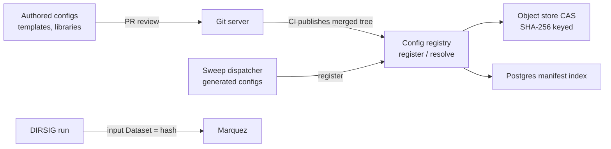
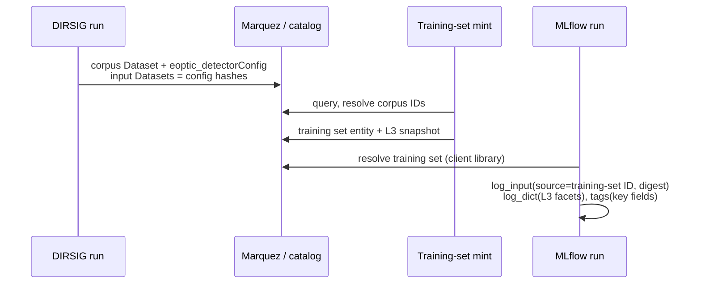

# MANIFOLD Engine Configuration Provenance

Sep 24, 2026 · Kevin Kearney

Engine configuration files are input Datasets identified by a SHA-256 tree hash and stored once; governed fields are extracted into facets at execution and propagate to consumers by snapshot.

## Engine configuration as input Datasets

DIRSIG XML is not attached as a facet and is not transcribed to JSON. Each configuration component is an OpenLineage input Dataset of the Run, with namespace `git://<config-repo>` or the registry realm, name = file path, and the `version` facet = content hash. Lineage queries such as "which corpora consumed atmosphere file X at version Y" become graph traversals in Marquez.

| Component class | Examples | Dataset granularity |
| --- | --- | --- |
| Reused across runs | Atmosphere, materials database, scene geometry, platform | One Dataset per component |
| Per-run | `.sim` / `.jsim`, `.tasks` | Folded into the parameter-set Dataset under one tree hash |

- **Identity is the resolved closure.** The version is a Merkle hash over every file the run consumed, including includes and dispatch-time generated files. A file generated at dispatch is registered before the run starts, preserving identity-before-execution.
- **Sweeps are template plus deltas.** One template, one sweep definition, and per-run resolved values in a small facet. N near-identical trees are not stored. The carrier for sweep structure remains the open L4 question.
- **Storage scales with distinct content.** Byte-identical files resolve to one key regardless of run count.
- **Format mix.** DIRSIG5 simulation files can be JSON (`.jsim`); scene, platform and materials inputs remain XML or legacy text. Hash reference is format-independent.

## Store and service

A config registry service fronts two backends. Lineage events and facets reference only the registry hash and are independent of which backend holds the bytes, as `corpus://` locators are independent of physical storage.

The interface is two calls: `register(tree) → sha256` and `resolve(sha256) → bytes, manifest`.

| Backend | Holds | Write rate | Reason |
| --- | --- | --- | --- |
| Git (Gitea, GitLab/Gitaly, GHES) | Human-authored templates, scene, platform, atmosphere, materials libraries | Low | Review and diff workflow |
| Object store CAS (S3/MinIO) + Postgres index | Machine-generated sweep instances, dispatch-time resolved files | High | Idempotent, horizontally scalable writes |

Git is excluded from the machine-write path:

- **Ref contention.** Ref updates serialize per repository; 10⁴ commits per sweep contend on one ref or fragment into branches.
- **History growth.** Millions of generated commits degrade packing, GC and replication; pruning breaks permanent resolution.
- **Commit hash is not content identity.** It includes author, timestamp and parent, so identical content yields distinct IDs. Tree hash, or registry SHA-256, is the identity key.
- **Hash function.** Git defaults to SHA-1; SHA-256 repository support in hosting and tooling is limited.

Single-backend alternatives, not selected: lakeFS (git-like branch/commit over object storage) and OCI registries via ORAS (digest-addressed artifacts). Neither is required absent a branching requirement over generated sets.

## Consumer path: detector parameters to MLflow

Detector parameters reach the consumer as a governed facet, `eoptic_detectorConfig` (L3), written at execution and snapshotted forward. The consumer never resolves the XML hash.

1. **Execution.** The run parses its configuration and emits `eoptic_detectorConfig` on the corpus Dataset in the same OpenLineage event, one entry per mount-instrument pair.
2. **Training-set mint (LC-6).** The resolved corpus list is minted immutable, with the L3 facets snapshotted onto the entity.
3. **MLflow run start.** MLflow does not consume OpenLineage natively; the MANIFOLD client pushes metadata. `mlflow.log_input` carries the training-set ID as source and the content hash as digest; L3 facets are logged via `log_dict`; high-value fields are tags or params for UI search.
4. **Query.** Detector parameters are read from the MLflow run. Full provenance is one hop: training-set ID → catalog.

**Denormalization is drift-free.** LC-4 makes corpus fields immutable and field-collected L3 entries carry a twin epoch, so a snapshot taken at mint cannot diverge from its source.

**Heterogeneous training sets.** A set spanning several detectors carries an L3 list keyed by corpus and entry. Per-sample detector conditioning requires the L5 → L3 frame tag and a Croissant projection exposing L3 fields per record; stock loaders do not provide this without a template.

## Changes to Metadata Architecture v0.5

| Location | Current | Proposed |
| --- | --- | --- |
| §5.3, `eoptic_sceneConfigRaw` | Parsed JSON of engine configuration | Replaced by a reference facet: tree hash + manifest (path → blob SHA-256). Unnamed fields recovered by on-request parse of stored blobs, marked backfill under MD-9 |
| §5.3, `eoptic_sceneEvent` | Governed extraction | Unchanged |
| Prototype invariant, `parameter_set_id` | Git commit hash of configuration | Registry SHA-256 of the resolved tree |
| Run inputs | Not specified for engine configuration | Configuration components declared as input Datasets with `version` = hash |
| LC-6 training set | Corpus ID list, query, catalog state | Adds L3 snapshot facet |

**A-13 holds** where the configuration registry is the executing system's store and MANIFOLD holds references only. Registry permanence is then a dependency: append-only policy on the store, or a blob mirror inside MANIFOLD's storage boundary, which is a separate decision.

## Open questions

- [ ] L3 snapshot on the training-set entity as a facet, or pushed to MLflow only at run start
- [ ] Registry permanence: append-only policy on the config store, or blob mirror inside MANIFOLD
- [ ] Sweep delta facet: carrier and schema, dependent on L4 disposition
- [ ] Per-record L3 exposure in the Croissant template for detector-conditioned training
