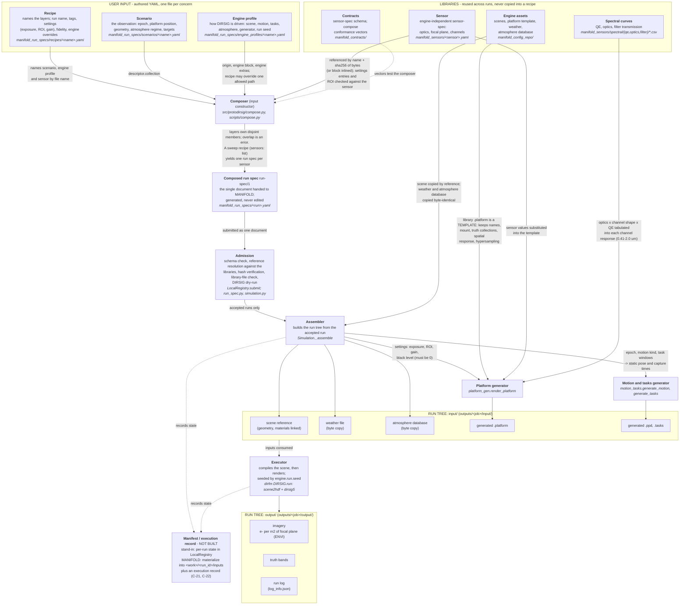

# From user YAML to run tree

Each node: function in plain terms, then (in italics) where it lives. Edge labels state what the flow does.
`<name>` is a file stem; `<run>` is a composed run name; `<job>` is a job directory under `outputs/`.

